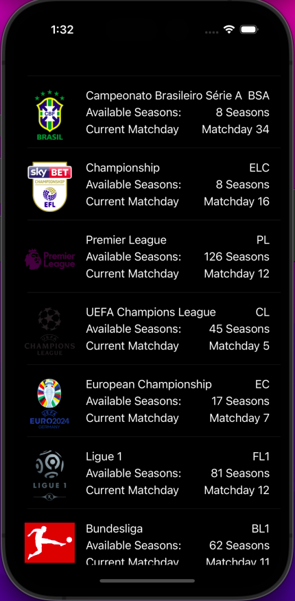
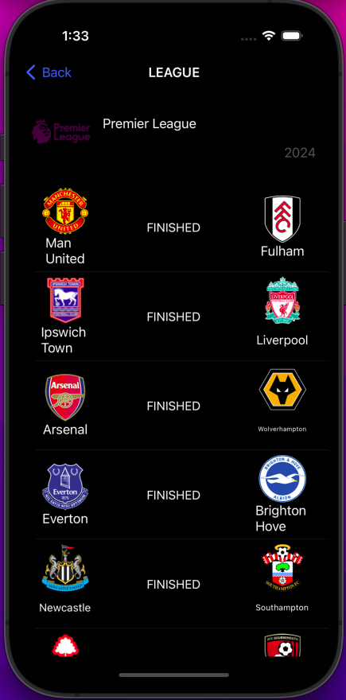
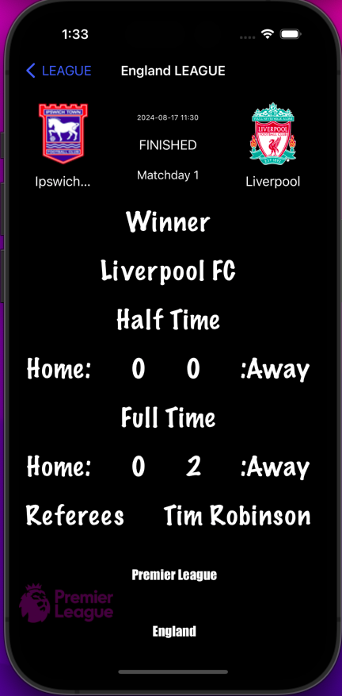

# Football League Application

## Overview

The Football League application allows users to explore football competitions, view match details, and see detailed information about individual matches. The app consists of three main screens that provide an organized way to interact with the data of different football leagues and competitions.

## Features

- **Main Programming Language**: Swift
- **Architecture**: MVVM (Model-View-ViewModel) architecture pattern.
- **Data Handling**: The application fetches data from external APIs and caches the retrieved data locally.
- **Offline Support**: In case of no internet connection, the app will display cached data and work offline seamlessly.
- **Reactive Programming**: The app uses **RxSwift** for reactive programming to handle asynchronous data fetching and updates.

### Screens

#### 1. Competitions List Screen
- Displays a list of all available football competitions.
- For each competition, shows:
  - The number of available seasons.
  - The current match day.
  - The league name, including its full name and code.

#### 2. Competition Details Screen
- Displays detailed information about the selected competition, including all possible available details.
- Shows a list of all matches within the selected competition, with details for each match:
  - Match status.
  - Home team name and short name.
  - Away team name and short name.

#### 3. Match Details Screen
- A scrolled view displaying detailed information about a selected match, including all available details.

## Technologies Used
- **Programming Language**: Swift
- **Architecture**: MVVM (Model-View-ViewModel)
- **Reactive Programming**: RxSwift
- **Data Caching**: Core Data to store data for offline use.
- **Networking**: Custom API Client using Alamofire for fetching data from APIs.

## Offline Support

- The application caches the data retrieved from the API. When there is no internet connection, the app will display the cached data to ensure that the user experience remains uninterrupted.
- Cached data is automatically updated when the internet connection is restored.

